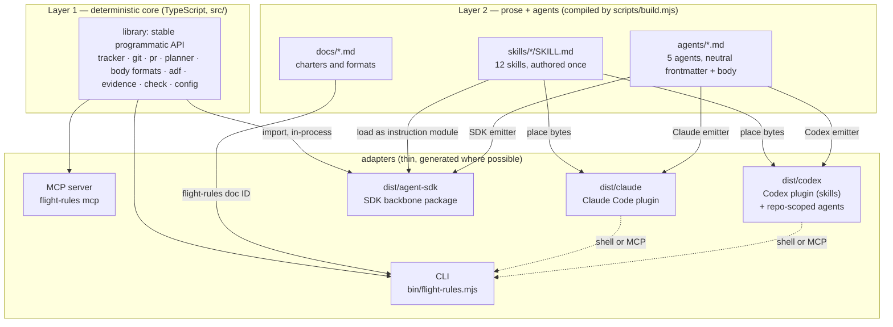
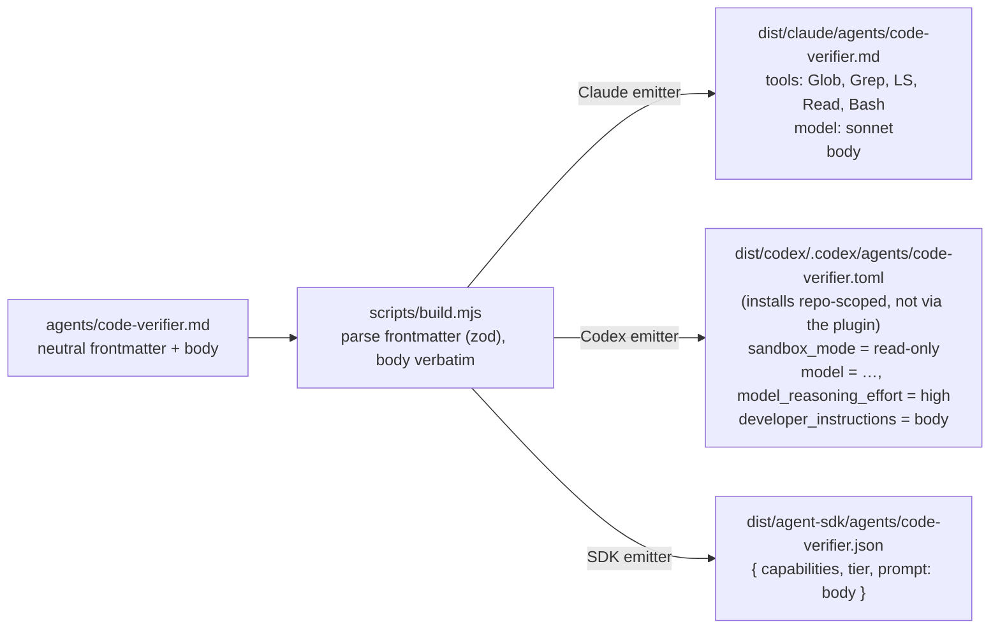
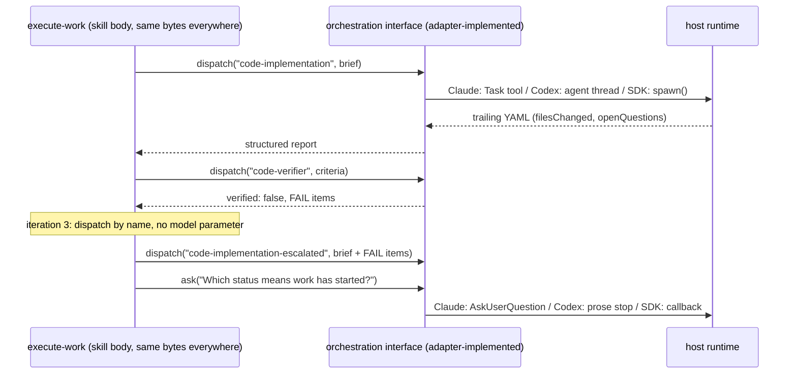
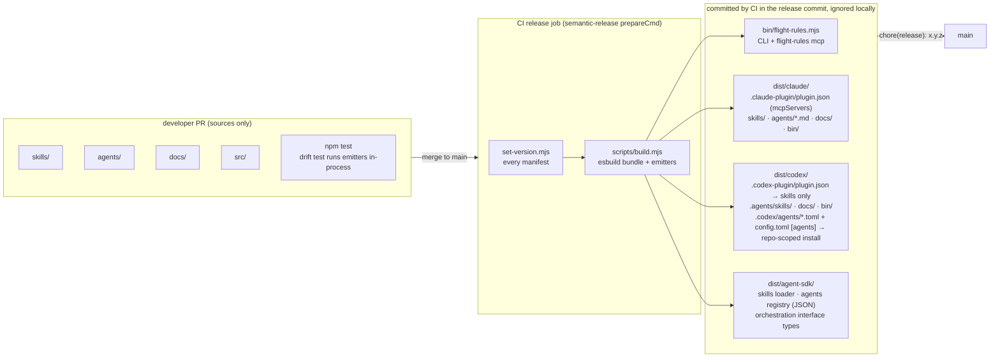

# Harness-agnostic core with thin native adapters

## Problem Statement

flight-rules is authored as a Claude Code plugin, so every other host (Codex CLI, a programmatically-written agent on an SDK) can only get it by re-authoring the skills and agents in that host's format, and two authored copies drift.

## Solution

Reframe flight-rules as a harness-agnostic core with one thin adapter per host. The core is authored once. Each adapter is compiled from it and never re-authors a skill or agent body.

- Publish the deterministic TypeScript in `src/` as a library with a stable programmatic API. The CLI becomes one adapter over it. An MCP server becomes a second, optional adapter over the same functions.
- Keep `SKILL.md` as the canonical skill form. Neutralize the bodies once (paths become `flight-rules doc <id>`, tool proper nouns become capability language, the config path becomes what `flight-rules config path` reports). Every adapter places the same bytes where its host discovers them.
- Author each agent once as a `.md` with a neutral frontmatter schema and a prose body. `scripts/build.mjs` grows an emitter per host that maps the frontmatter to the host's serialization and emits the body verbatim. Claude's `.md` format stops being the source; it becomes one more emitted target.
- Make two vocabularies the contract between a neutral agent definition and each adapter: a capability vocabulary (`read`, `edit`, `shell`, `web`, `spawn`, `ask`) and a model-tier vocabulary (`standard`, `escalated`, `expert`). Tickets #91 and #90 already sketch both. This RFC promotes them from cleanup to the mechanism that makes agents portable.
- Define a small orchestration interface (dispatch an agent, dispatch many with a concurrency bound, ask a human, escalate) that each adapter implements. Skills speak to the interface; adapters bind it to the Claude Task tool, Codex agent threads, or an SDK `spawn()`.
- Add three build targets: `dist/claude`, `dist/codex`, `dist/agent-sdk`. Keep them in this repo. `bin/` and `dist/` become CI-only artifacts: ignored locally, generated and committed by CI at release. Create separate publish repos only if a host's native install path is found to require one.
- Ship the Codex adapter in two parts, because Codex's plugin manifest carries skills but not agents: skills through the plugin, agents as repo-scoped `.codex/agents/*.toml` the build emits into the consuming project.
- Build on epic #87 rather than replacing it: keep its nine tickets, reframe four of them under the core-plus-adapters model, and add the library extraction, the Claude emitter, the orchestration interface, the MCP adapter, the SDK target, and the release pipeline as net-new work.

## Background

Epic #87 ("Run flight-rules on Codex CLI as well as Claude Code", children #88 through #96) is the first step and it is well shaped. It inventories the Claude coupling, proposes `flight-rules doc` and `flight-rules config path`, generates Codex `.toml` agents at build time, and extends the drift test so the two trees cannot silently diverge. Two of its findings are the seed of this RFC. First, the coupling is a thin shell: the CLI, the charters, the layered-body format and the skill bodies never ask which agent is calling them. Second, exactly two design assumptions break rather than translate: per-dispatch model override (#90) and the sandbox (#94).

What #87 does not do is decide what the source of truth is. Ticket #89 keeps the Claude markdown as the source and compiles Codex outward. That works for two hosts. It leaks the moment a third target appears. An SDK adapter has to parse Claude's `tools: Glob, Grep, LS, Read` list and reverse-engineer what the agent is allowed to do. The owner's direction, verbatim:

> No single host's format should be privileged as the master.

> I want native installation paths per host: a proper Claude plugin, a proper Codex plugin. Not a bespoke installer script.

The second goal, using flight-rules as the backbone of a programmatically-written agent, is deliberately late-bound. The harness (Claude Agent SDK or another) is not decided. What is decided is that such an agent should import the core in-process and typed, not shell out to its own CLI.

The tree as measured for this RFC differs from #87's inventory: there are twelve skills and five agents, not eight and four, and `${CLAUDE_PLUGIN_ROOT}` appears 33 times across eight skills and four agents. `skills/verify-ticket/SKILL.md:99` also passes `model: sonnet` on a `qa-engineer` dispatch, a second per-dispatch override #90 does not list.

## Technical Notes

### The two layers and what each compiles to

flight-rules has two kinds of source, and they compile differently. Layer 1 is deterministic TypeScript and compiles with esbuild. Layer 2 is prose plus agent definitions and compiles with `scripts/build.mjs` acting as a small compiler over markdown. Every adapter is the pairing of one emitted Layer 2 tree with one way of reaching Layer 1.



The dependency direction is fixed: the CLI imports the library, never the reverse. A library that shells out to its own CLI pays a subprocess per call, loses its types at the process boundary, and parses its own JSON back. That option is rejected.

### Layer 1: the core as a library

`bin/flight-rules.mjs` is already close to this. `src/cli/cli.ts` is 132 lines of commander wiring; the behaviour lives in services under `src/tasks`, `src/git`, `src/pr` and `src/shared`. `buildProgram` takes its dependencies as getters (`getTracker`, `getConfig`, `getPrHost`, `getConfigPath`), which is the seam a library entry point needs. The work is a packaging and API-surface job, not a rewrite.

- Add `src/index.ts` as the public surface and an `exports` map in `package.json`. The surface is the services that exist: `TaskTracker` with its Jira and GitHub implementations, `PullRequestHost`, `GitExecutor`, the commit-message builder and PR template, `DependencyPlanner`, body-sections and body-format detection, `BodyMetadataService`, markdown to ADF and back, `EvidenceService`, `ToolProbe`, config resolution, and the doc resolver #88 adds.
- Add one factory, `createFlightRules({ cwd, env, configPath })`, that does what `buildTracker`, `buildPrHost` and `getConfigFromEnv` do in `cli.ts`, and returns the typed services. `run()` in `cli.ts` calls the factory and hands its getters to `buildProgram`. The `preflight/no-loose-functions` suppressions in `cli.ts` that cite KAN-39 are the same loose functions; this gives them their home.
- Semantic versioning applies to the exported surface from the first release that carries it. The CLI's JSON output is already a contract skills depend on; the library surface is that contract with types.
- One npm package, `@good-ground-collective/flight-rules`, with an `exports` map: `.` for the library, `./agent-sdk` for the SDK target, and the existing `bin`. Workspaces (`core`, `cli`, `mcp`, `agent-sdk`) are deferred. They become worth their cost only if the SDK adapter's dependency footprint forces a split, and the `exports` map is the seam that makes that split non-breaking later.

The MCP server is a second adapter over the same functions and it is built second. `flight-rules mcp` runs a stdio server whose tools mirror the CLI verbs (`ticket_get`, `epic_get`, `git_checkout`, `pr_create`, `doc`, `check`) and return the same JSON. The Claude target declares it in `plugin.json` under `mcpServers` with `${CLAUDE_PLUGIN_ROOT}/bin/flight-rules mcp` as the command; the Codex target ships a `[mcp_servers.flight-rules]` block. It gives Claude and Codex the flight-rules operations as native tools instead of bash shell-outs, and it is the adapter for any consumer that is out-of-process or not TypeScript. It is optional: the CLI path keeps working, and the skill bodies keep saying `flight-rules ticket get <id>`, which the drift test polices.

### Layer 2: the sources are the master definition

No new manifest format and no meta-DSL. The files under `skills/`, `agents/` and `docs/` are the master definition. The build grows targets; the sources do not grow a layer of indirection. Skills and agents are handled differently because they are different problems.

```text
skills/<name>/SKILL.md          canonical form is already cross-host      →  place, do not compile
agents/<name>.md                canonical form is a NEUTRAL frontmatter   →  emit per host, body verbatim
docs/<name>.md                  reached through `flight-rules doc <id>`   →  ship once, resolve at runtime
```

#### Skills: authored once, placed everywhere

`SKILL.md` with `name` and `description` frontmatter is the same open standard on Claude Code and Codex. Compilation is near zero. The work is neutralizing the body, and #88, #91 and #92 already describe it: a path interpolation becomes `flight-rules doc <id>`; a tool proper noun becomes the capability it names; the literal `.claude/flight-rules.local.md` becomes what `flight-rules config path` reports. After that pass the same bytes ship in every target.

Each adapter places the file where its host discovers it. Claude reads a plugin's `skills/<name>/SKILL.md`; it does not scan `.agents/skills/`. Codex reads `.agents/skills/` walking up to the repo root, then `$HOME/.agents/skills`. The SDK adapter loads the body as an instruction module its orchestrator hands to the model. `dist/codex` copies; it never transforms, and #93's acceptance criterion that the bytes match across trees is the invariant to protect.

#### Agents: one neutral definition, three serializations

An agent is the same logical thing serialized three ways: Claude `.md` frontmatter, Codex `.toml`, and an SDK registration object. Treating the Claude `.md` as the source privileges one host and forces every later adapter to reverse-engineer Claude's tool list. The canonical form is instead a `.md` per agent with a small neutral frontmatter and the prose body. The proposed schema, to be refined in the enabling ticket:

```yaml
name: code-verifier
description: Verifies a completed implementation against a ticket's acceptance criteria …
capabilities: [read, shell]        # capability vocabulary, not tool names
model: standard                    # standard | escalated | expert; a tier, not a model id
reasoning: high                    # optional; hosts that lack the knob ignore it
sandbox:                           # optional; the strictest expression the host supports
  fs: read-only
  network: none
dispatch:                          # optional; only orchestrator-facing agents set it
  maxConcurrent: 8
  maxDepth: 1
```

The body emits verbatim: Claude system prompt, Codex `developer_instructions`, SDK system prompt. Each emitter maps the frontmatter to its native serialization. Where a host has no knob, the emitter drops the key and says so in the build log; it never invents behaviour.



The mapping each emitter owns, by frontmatter key:

| Key | Claude emitter | Codex emitter | SDK emitter |
|---|---|---|---|
| `capabilities` | expands to a `tools:` list from a fixed table (`read` → Glob, Grep, LS, Read; `edit` → Write, Edit; `shell` → Bash; `web` → WebSearch, WebFetch) | `edit` present → `sandbox_mode = "workspace-write"`, else `"read-only"`; `web` has no per-agent knob and is documented | an allowed-capability set the runtime enforces when it registers tools |
| `model` | tier → alias via a reviewable table (`standard` → `sonnet`, `escalated` → `opus`, `expert` → the top Claude model) | tier → concrete model id via the same kind of table (`expert` → the top Codex model) | tier → whatever the harness configures; the adapter owns the table |
| `reasoning` | `effort` when supported | `model_reasoning_effort` | runtime option or dropped |
| `sandbox` | no-op today; emitted as a comment | `sandbox_mode` | runtime config |
| `dispatch` | no-op (Claude has no cap) | `[agents]` `max_threads` / `max_depth` in the shipped config | orchestrator limits |
| `color` | kept as a Claude-only key under an `x-claude` block, or dropped | dropped | dropped |

Unknown keys fail the build. That is what keeps the neutral schema neutral: a Claude-only or Codex-only key cannot creep into the source without going through the schema and the review it implies.

#### The two enabling vocabularies

A neutral agent definition is only writable if two vocabularies exist. Epic #87's coupling inventory rates both as low-severity cleanup. They are the mechanism.

The capability vocabulary (#91) is the runtime contract between a definition and an adapter. `capabilities: [shell]` is a promise the adapter makes: "when this agent asks to run a command, here is how." The vocabulary this RFC proposes is `read`, `edit`, `shell`, `web`, `spawn`, `ask`. `spawn` and `ask` are new relative to #91 and are what orchestrating skills need: `break-down-work` spawns research agents and asks the human at six hard stops; `execute-work` spawns two agents in alternation and asks once per missing config field. In the skill bodies the vocabulary is prose ("stop and ask the human, and wait for an answer"). In the agent frontmatter it is a list. In the adapter it is a table.

The model-tier vocabulary (#90) is `standard`, `escalated` and `expert`. `expert` maps to each host's top model (Fable on Claude, Astra on Codex) and no agent consumes it yet; it is in the vocabulary so that adding a top-tier agent later is a frontmatter edit, not a schema change. Today the tiers are implied by hard-coded aliases. `code-implementation` and `code-verifier` run `sonnet`; `research-agent`, `tech-writer` and `qa-engineer` run `opus`. `execute-work` escalates the implementer to `opus` on iteration 3 by passing `model` on the dispatch, and `verify-ticket` de-escalates `qa-engineer` to `sonnet` the same way. Codex has no per-dispatch override, and an SDK has whatever the adapter gives it. The fix #90 proposes holds: the orchestrator dispatches by agent name, and a dedicated `code-implementation-escalated` agent carries the tier. The same treatment applies to `qa-engineer`: a `qa-engineer` for reproduce and a `qa-engineer-verify` at `standard` tier, or one agent whose mode selects nothing about the model. After migration the five agents sit on `standard` (implementer, verifier, `qa-engineer-verify`) and `escalated` (research, tech-writer, `qa-engineer`, `code-implementation-escalated`); `expert` stays empty.

### The genuinely hard part: orchestration portability

Docs and the CLI port trivially. Agents port once the vocabularies exist. The seam that does not port on its own is dispatch. `execute-work` step 6 is "dispatch `code-implementation`, then dispatch `code-verifier`, read `verified`, loop at most three times, escalate on the third." `break-down-work` step 4 is "dispatch every research brief at once." Each host expresses that differently. Claude has the Task tool with a `model` parameter and no fan-out cap. Codex has agent threads bounded by `[agents] max_threads` (default 6) and `max_depth` (default 1). An SDK has `spawn()` or a `query()` per sub-agent, in-process.

The master definition needs a small orchestration interface that each adapter implements. The skills speak to it in capability prose; the adapter binds it.

```text
dispatch(agent, brief) -> structured report        one sub-agent, by name, returns its trailing YAML
dispatchMany(briefs, { maxConcurrent })            parallel fan-out with a bound; batches above it
ask(question) -> answer                            hard stop for a human; never guessed past
escalate is not a verb                             it is dispatch of a differently-tiered agent
limits { maxConcurrent, maxDepth }                 read from the adapter, not assumed by the skill
```



#90 and #95 are the down payment: #90 removes the one place the orchestrator reaches past the interface (`model` on dispatch), and #95 gives `dispatchMany` its bound and ships the Codex `[agents]` config that raises it. The SDK backbone adds one more implementation of the same interface. The interface is documented in `docs/`, not encoded in a runtime. On Claude and Codex the "implementation" is the host reading the skill's prose. The drift test checks that the prose names agents that exist and never names a host tool.

### What "available in every adapter" means

Adding an adapter is two things and never a third. It is (a) a static emitter in `scripts/build.mjs` that maps the neutral agent frontmatter to the host's serialization and places the skill bytes where the host reads them. And it is (b) a runtime shim that implements the orchestration interface and the capability table. It is never a re-authoring of a skill or agent body. Twelve skill bodies and five agent bodies are written once, neutrally, and every host gets them by compiling, not copying.



`bin/` and `dist/` are CI-only. A developer never builds or commits either; both are gitignored in a working tree and exist in the repository only inside release commits, which CI produces from `semantic-release`'s `prepareCmd` (`set-version.mjs`, then `build.mjs`) and lists in the `@semantic-release/git` assets. Today `bin/flight-rules.mjs` is rebuilt and committed in every PR that touches `src/`, and `execute-work` step 7 instructs the agent to do so; two open PRs that both touch `src/` then conflict on the bundle every time and merge serially. Moving the artifact to the release commit removes that conflict and the instruction. What a PR must still prove is that the emitters run: `npm test` invokes them in-process (the drift test #96 already prefers calling the generator over depending on a prior build), and CI runs `npm run build` as a check without committing the output.

### Repository topology

The owner's straw proposal: core stays in `flight-rules`, and `flight-rules-claude`, `flight-rules-codex` and `flight-rules-agent-sdk` hold the native adapters. The deciding factor is how each host installs a plugin, so that was checked against reality before weighing the options.

Claude Code. A marketplace manifest lives at `.claude-plugin/marketplace.json` at the repo root, and each plugin entry's `source` may be a relative subdirectory (`"./dist/claude"`), a `github` repo with `ref` or `sha`, a `git-subdir` with a `path`, or an npm package. Today's manifest uses `"source": "./"`, which is why the whole repo is the plugin. A plugin does not have to be a repo root.

Codex CLI, verified against the installed 0.154.0. `codex plugin marketplace add <SOURCE>` accepts a local path, `owner/repo[@ref]`, an HTTPS or SSH git URL, and `--sparse <PATH>` for a subdirectory. Plugins are declared in `.agents/plugins/marketplace.json` with relative paths, and each plugin carries `.codex-plugin/plugin.json`. That manifest's schema declares `skills`, `apps`, `hooks` and an `interface` block. It has no agents component, and every installed OpenAI plugin, including `deep-research-work`, ships skills and apps only. Codex agents install in exactly two places: repo-scoped `.codex/agents/*.toml` in the project, or personal `~/.codex/agents/*.toml`, placed directly. #93's `components` block does not match what 0.154.0 installs and is re-derived from this.

So the Codex adapter is two deliveries from one build. Skills ship through the plugin: `dist/codex` is the plugin root, its `.codex-plugin/plugin.json` points `skills` at the placed `SKILL.md` files, and `codex plugin marketplace add Good-Ground-Collective/flight-rules` installs them. Agents ship repo-scoped: the build emits `.codex/agents/*.toml` and the `config.toml` `[agents]` block into a tree the consuming project drops in at its root, and `setup` performs and verifies that placement on Codex. `~/.codex/agents/` is documented for personal use. The split is a property of the host, not of this design, and it is stated in the Codex target's install docs so nobody looks for agents in the plugin.

Neither host strictly requires a repo-root plugin. That removes the strongest argument for the polyrepo.

One lead worth verifying before E3 starts, and not built on here: the Codex 0.154.0 binary recognizes `.claude-plugin/plugin.json` and `.cursor-plugin/plugin.json` alongside `.codex-plugin/plugin.json`. If Codex can read a Claude plugin manifest directly, cross-host packaging is more unified than this RFC assumes and `dist/codex` may shrink to the repo-scoped agents tree. Until that is tested against a real install, the two-manifest design stands.

```text
Option A — monorepo, CI generates + commits targets at release    Option B — polyrepo, generated trees pushed to publish repos

flight-rules/                                                     flight-rules/            (core: src/, skills/, agents/, docs/)
├── src/  skills/  agents/  docs/        ← authored                  └── CI build → push generated trees ──┐
├── scripts/build.mjs                    ← compiler                                                          │
├── bin/flight-rules.mjs                 ← CI-only, release commit  flight-rules-claude/   ← generated  ◄──┤  marketplace source: owner/repo
├── dist/claude/    ← plugin root         (CI-only, release commit)  flight-rules-codex/    ← generated  ◄──┤  marketplace source: owner/repo
├── dist/codex/     ← plugin root (skills) + repo-scoped agents      flight-rules-agent-sdk/← generated  ◄──┘  npm publish
├── dist/agent-sdk/ ← npm export
├── .claude-plugin/marketplace.json  → source: "./dist/claude"
└── .agents/plugins/marketplace.json → source: "./dist/codex"

one PR changes core + every adapter atomically                    clean repo-root install per host; independent versioning
drift test (#96) is local                                          drift test spans four repos
release = one CI commit carrying bin/ + dist/                      release = core release + a publish pipeline per repo
```

Option A, monorepo with generated targets, is the recommendation. The reasons, in order of weight:

1. Every adapter tree is generated from core, so the polyrepo's adapter repos hold nothing a human edits. Four repos whose contents are write-only outputs of a fifth is a publish pipeline with a repo attached, and the pipeline is the part that breaks.
2. #96's drift test is the thing that makes the port survivable. In a monorepo it reads `agents/` and every `dist/*` tree in one process. Across repos it becomes a cross-repo CI job that runs after a push it did not trigger.
3. The repo already commits a build artifact at release. `bin/flight-rules.mjs` is rebuilt by semantic-release's `prepareCmd` and listed in the `@semantic-release/git` assets. `dist/claude`, `dist/codex` and `dist/agent-sdk` join that list, and the whole set becomes CI-only. Nothing new is invented; one existing habit (developers committing `bin/`) is removed.
4. Both hosts install from a subdirectory of a git repo, so the native install path is intact: `claude plugin marketplace add Good-Ground-Collective/flight-rules` and `codex plugin marketplace add Good-Ground-Collective/flight-rules`.

The polyrepo's real advantages are independent versioning and a repo whose root is the plugin. Neither is needed for this initiative, and both are recoverable later. A thin publish repo is a `git subtree split` of `dist/claude` pushed on release. It can be added the day a host requires it without moving any source. The recommendation is therefore monorepo now, and separate publish repos only where a native install path is found to strictly require a repo-root plugin. Codex's inability to ship agents in a plugin does not change this: its agents install repo-scoped from the same `dist/codex` tree, as described earlier.

One consequence to state plainly: today's Claude install treats the repo root as the plugin, with `skills/` and `agents/` in Claude's native placement. Under this RFC the plugin root moves to `dist/claude`, and `agents/` at the repo root becomes neutral source that Claude cannot load directly. That is the point: Claude stops being privileged. It is a one-line change to `marketplace.json`, and there is no migration path: existing installs are removed and re-added fresh against the new root.

### Relationship to epic #87

This RFC does not replace #87; it changes what its tickets are for. Every existing ticket stays. Four are reframed, and the net-new work sits around them.

| Ticket | Disposition | What changes |
|---|---|---|
| #88 `flight-rules doc` | stays, keystone | Also becomes the first library function with a public signature (`resolveDoc(id)`); its `$FLIGHT_RULES_HOME` resolution has to work from `dist/*/bin` as well as `bin/`. |
| #89 Codex TOML from agent markdown | reframed | The input is the neutral frontmatter, not Claude's `tools:`/`model:` keys. `sandbox_mode` keys off `edit` in `capabilities`, not `Write`/`Edit` in a tool list. A Claude emitter is added beside it, so Claude output is generated too. |
| #90 escalated implementer agent | elevated | Becomes the model-tier vocabulary ticket. Adds the `qa-engineer` verify-mode override in `verify-ticket:99` to its scope. Defines `standard`/`escalated`/`expert` and the per-host tier tables; `expert` is reserved and unused. |
| #91 capability language | elevated | Becomes the capability vocabulary ticket. Adds `spawn` and `ask`, and puts `capabilities:` into the agent frontmatter schema, not only the prose. |
| #92 `flight-rules config path` | stays | Unchanged. |
| #93 Codex build target | reframed | Emits `.codex-plugin/plugin.json` and `.agents/plugins/marketplace.json` matching Codex 0.154.0, not a `components` block. Skills ship in the plugin; `.codex/agents/*.toml` and the `[agents]` config from #95 ship as a repo-scoped tree, and `setup` places them on Codex. Documents the split, and `~/.codex/agents/` for personal use. |
| #94 sandbox fail-early | stays | Unchanged; belongs to the Codex adapter's runtime shim. |
| #95 fan-out bounds | reframed | Becomes the first implementation of the orchestration interface's `dispatchMany` bound and `limits`. |
| #96 drift test | stays, extended | Polices every `dist/*` target, not two trees, and the neutral schema's unknown-key rule. Still lands last. |

Net-new tickets this RFC adds:

- N1. Library extraction: `src/index.ts`, `createFlightRules()`, an `exports` map on the single existing npm package, semver on the surface, `cli.ts` consumes the factory. Workspaces are out of scope for this ticket and deferred.
- N2. Neutral agent frontmatter schema as a zod schema in `src/`, shared by the build and the drift test; the five agents migrate to it; the tier enum is `standard | escalated | expert`.
- N3. Claude emitter and `dist/claude` target; `marketplace.json` source moves to `./dist/claude`; existing installs re-install fresh, no migration.
- N4. Orchestration interface documented in `docs/orchestration-interface.md`; `execute-work`, `execute-wave`, `break-down-work`, `reproduce-bug` and `verify-ticket` rewritten to speak it (dispatch by name, bounded fan-out, hard-stop ask).
- N5. Release pipeline: `bin/` and `dist/` become CI-only. Both are gitignored in working trees and removed from PR expectations; `set-version.mjs` writes every manifest; `prepareCmd` builds all targets; the `@semantic-release/git` assets carry `bin/` and `dist/*` into the release commit; `npm pack` ships `docs/` and `dist/`; `execute-work` step 7 drops its "rebuild the bundle before committing" instruction; CI keeps `npm run build` as a check on every PR without committing its output.
- N6. MCP adapter: `flight-rules mcp` stdio server over the library, declared in both plugin manifests; optional and second.
- N7. SDK target: `dist/agent-sdk` with a skills loader, an agents registry emitted from the neutral definitions, and the orchestration interface as TypeScript types with one reference implementation against the first chosen harness.
- N8. Per-host install docs and a scratch-repo install test for each target, replacing #93's single Codex install criterion.

## Known Gaps and Edge Cases

- Codex agents cannot ride in a Codex plugin (verified against 0.154.0), so a Codex user gets skills from the marketplace and agents from a repo-scoped tree. Two install steps is a real cost; `setup` on Codex has to perform the second one and `check` has to notice when it is missing.
- Codex 0.154.0 recognizing `.claude-plugin/plugin.json` and `.cursor-plugin/plugin.json` is an unverified lead. If it holds, `dist/codex` may reduce to the repo-scoped agents tree. E3 tests it before emitting a second manifest.
- The SDK harness is undecided by design. N7 defines the interface and emits the registry; it implements the interface against one harness only when that harness is chosen. Nothing else in this RFC waits on that choice.
- `expert` is a reserved tier with no consumer. An emitter still needs a row for it in every tier table so the schema is honest, and the drift test should flag an agent that adopts it without a reviewed reason.
- The `web` capability has no per-agent expression on Codex; it is a session setting. The emitter documents it rather than mapping it, and `research-agent`'s body already has to state what to do when web access is absent (#91).
- Release commits grow: they carry `bin/` and three `dist/` trees. They are CI-authored and touch no source, so the noise is confined to `chore(release)` commits. A `release` branch remains the alternative if the history becomes hard to read.
- Between the release that moves the Claude plugin root and a user's re-install, an existing install points at a root that no longer contains a plugin. There is no compatibility shim; the install instructions say remove and re-add.
- A PR can no longer be run from its branch with a fresh `bin/`. Anyone testing a branch runs `npm run build` locally into an ignored `bin/`, which is what CI does; the drift test and unit tests, not the bundle, are the PR-time proof.
- The library surface freezes shapes that were only ever CLI-internal. Anything exported in N1 is a semver commitment; the ticket should export less rather than more and grow on demand.
- The MCP adapter duplicates the CLI verbs. The drift test should assert the two surfaces agree (same verbs, same JSON), or the MCP surface should be generated from the commander program rather than written beside it.
- Out of scope: retiring the GitHub tracker, splitting the package into workspaces, and any change to skill semantics beyond neutralizing host references.

## Epic Sketch

- E1. Core API and resolution: #88, #92, N1, N2. The CLI becomes a client of the library; docs and config resolve through it; the neutral agent schema exists.
- E2. Vocabularies: #90, #91. Capabilities and model tiers defined, agents and skill bodies migrated, per-dispatch overrides gone. Depends on E1 for the schema.
- E3. Emitters and targets: #89, #93, N3, N5. `dist/claude` and `dist/codex` generated from neutral sources, manifests match each host as installed, Codex agents emitted as a repo-scoped tree, `bin/` and `dist/` moved to CI-only release commits. Depends on E2.
- E4. Orchestration interface: #94, #95, N4. Dispatch, bounded fan-out and ask expressed once in the skills and documented as the contract adapters implement. Depends on E2; runs beside E3.
- E5. Guard and install: #96, N8. Drift test over every target; scratch-repo install per host. Lands last among the plugin targets.
- E6. Further adapters: N6 (MCP), N7 (SDK). Depend on E1 and E4; independent of each other.

E1 runs first. E2 follows. E3 and E4 run in parallel, then E5. E6 can start once E1 and E4 exist and does not gate anything.

## Definition of Success

- An engineer on Codex CLI installs the skills with `codex plugin marketplace add`, places the generated agents tree with `setup`, and runs `draft-request-for-comments`, `break-down-work` and `execute-work` end to end against a scratch repo, with no file in this repo authored for Codex.
- An engineer on Claude Code installs from the same repository and gets the same twelve skills and five agents, and nothing under `skills/` or `agents/` at the source root names a Claude tool, path, or model.
- A programmatically-written agent imports `@good-ground-collective/flight-rules`, reads a ticket, plans a wave and opens a PR through typed calls, without spawning the CLI.
- Adding a third host is one emitter and one runtime shim, and the pull request that adds it touches no skill or agent body.
- One prompt edit to a skill or agent lands in every target from one pull request, and `npm test` fails when any target would have diverged.
- No pull request other than a CI release commit touches `bin/` or `dist/`, and two PRs that both change `src/` merge without a bundle conflict.
